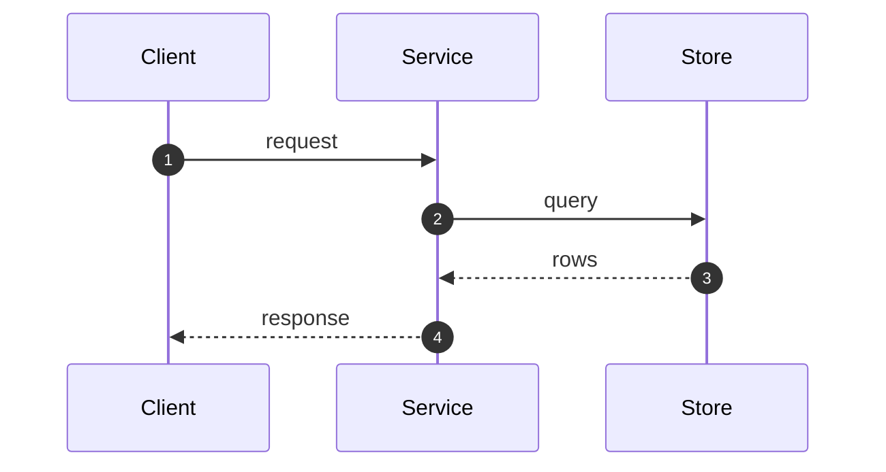
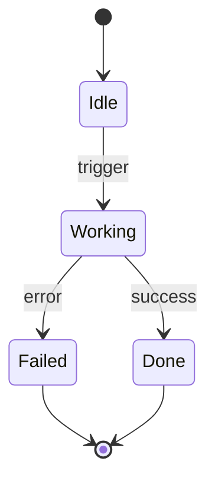

# Diagram patterns — copy-paste templates

## mkdocs.yml (the bits that matter)

```yaml
plugins:
  - search
  - d2:
      layout: elk        # elk (bundled) is great; tala is prettier but a separate binary
markdown_extensions:
  - admonition
  - pymdownx.details
  - pymdownx.superfences:
      custom_fences:
        - name: mermaid
          class: mermaid
          format: !!python/name:pymdownx.superfences.fence_code_format
  - attr_list
  - md_in_html
```

## D2 — structural (context / container / component)

Fenced as ```d2 — the plugin renders it to inline SVG at build time.

```d2
direction: right
user: Operator {shape: person; style.fill: "#9EB277"}
sys: My System {
  style.fill: "#1F7A78"; style.font-color: "#ffffff"
  api: API
  db: Store {shape: cylinder}
}
ext: External Service {shape: cloud; style.fill: "#7E5C8E"; style.font-color: "#ffffff"}
user -> sys: uses
sys.api -> sys.db: reads/writes
sys -> ext: calls
```

Notes: containers nest with `name: { ... }`. Newlines in labels: `\n` inside a quoted string.
Fills: `style.fill` / `style.font-color`. Shapes: `person | cloud | cylinder | hexagon | page | package`.

## Mermaid — behavioural

### Sequence (a flow across components)


### State machine (a workflow)


### Flow (a decision / roadmap)


Mermaid gotchas: avoid `**bold**` inside node labels (renders literally unless markdown-strings on);
`<br/>` for line breaks works. Mermaid is client-rendered — `mkdocs build` won't catch syntax errors,
so eyeball it in a browser.

## Brand CSS (diagram legibility in both schemes)

```css
.md-typeset .d2 svg, .md-typeset .mermaid svg {
  max-width: 100%; height: auto;
  background: #ffffff; border: 1px solid #E2DAD3; border-radius: 10px; padding: .8rem;
}
[data-md-color-scheme="slate"] .md-typeset .d2 svg,
[data-md-color-scheme="slate"] .md-typeset .mermaid svg { background: #f4efe9; }
```

## Verify render before deploy

```bash
mkdocs build --strict
# D2 rendered? raw source must NOT appear as visible text:
grep -q 'direction:' site/<page>/index.html && echo "WARN: d2 not rendered" || echo "d2 OK"
# Mermaid blocks preserved for client render:
grep -c 'class="mermaid"' site/<page>/index.html
```

## Deploy (Cloudflare Pages)
```bash
wrangler pages project create <name> --production-branch main   # first time
wrangler pages deploy site --project-name <name>
```
