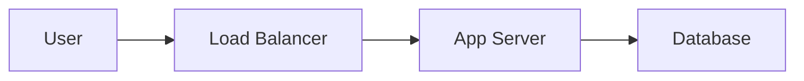

# Documentation Site Generator

Generate complete documentation sites as a directory of Markdown files with navigation configuration and brand theming. Outputs are ready to build with MkDocs Material or Docusaurus.

## When to Use

- Customer-facing documentation portals
- Project documentation for delivered engagements
- Internal knowledge bases and runbooks
- API reference sites with guides
- Operations and troubleshooting documentation

## Brand Integration

READ the `spectrocloud-brand` skill for colors, typography, and design principles before generating any themed site. Use the CSS custom properties from `references/colors.md` for all color values.

### CSS Custom Properties (from spectrocloud-brand)

```css
:root {
  --sc-teal: #1F7A78;        /* Primary brand */
  --sc-teal-dark: #005B5B;   /* Nav backgrounds, headers */
  --sc-teal-darkest: #043736;/* Deep contrast elements */
  --sc-green: #9EB277;       /* Secondary accent */
  --sc-gold: #F0BE65;        /* Highlights, callouts */
  --sc-orange: #B94B01;      /* Warnings, important */
  --sc-lilac: #7E5C8E;       /* Palette product accent */
  --sc-paper: #F7F1ED;       /* Background */
  --sc-ink: #012121;         /* Body text */
  --sc-neutral-2: #BEB9B6;   /* Borders, dividers */
}
```

## Output Structure

Every generated site follows this directory layout:

```
docs-site/
├── mkdocs.yml              # or docusaurus.config.js
├── docs/
│   ├── index.md            # Landing / overview (with co-branded logos)
│   ├── getting-started.md  # Quick start guide
│   ├── assets/
│   │   └── images/
│   │       ├── spectrocloud-logo.png        # SC logo for landing page
│   │       ├── spectrocloud-logo-white.svg  # SC logo for nav header
│   │       ├── favicon.png                  # SC favicon
│   │       └── customer-logo.svg            # Customer logo for landing page
│   ├── architecture/
│   │   ├── index.md        # Architecture overview
│   │   └── components.md   # Component deep-dives
│   ├── operations/
│   │   ├── index.md        # Ops overview
│   │   ├── deployment.md   # Deployment procedures
│   │   └── monitoring.md   # Monitoring and alerts
│   ├── troubleshooting/
│   │   ├── index.md        # Common issues
│   │   └── runbooks.md     # Step-by-step runbooks
│   ├── overrides/          # MkDocs theme overrides (inside docs/)
│   │   └── stylesheets/
│   │       └── brand.css   # Brand color overrides
│   └── reference/
│       ├── index.md        # Reference overview
│       ├── api.md          # API reference
│       └── configuration.md
└── static/                 # Docusaurus static assets
    └── css/
        └── brand.css
```

Adapt sections to the project. Not every site needs all sections. Omit what is irrelevant.

### Required Logo Assets

Always include these files in `docs/assets/images/`:

| File | Purpose |
|------|---------|
| `spectrocloud-logo-white.svg` | Header nav logo (set in `theme.logo`) |
| `spectrocloud-logo.png` | Landing page co-branding |
| `favicon.png` | Spectro Cloud favicon (set in `theme.favicon`) |
| `customer-logo.svg` (or `.png`) | Customer logo for landing page co-branding |

Source the Spectro Cloud logos from the `spectrocloud-brand` skill or existing project assets. Request or locate the customer logo as needed.

## File Naming Conventions

- **kebab-case** for all files and directories: `getting-started.md`, not `GettingStarted.md`
- **index.md** for section landing pages (not README.md)
- Group related pages in subdirectories when a section exceeds 3 pages
- Prefix numbered sequences only for ordered tutorials: `01-install.md`, `02-configure.md`

## MkDocs Material Configuration

Use this as the baseline `mkdocs.yml`. Adjust `site_name`, `nav`, and `repo_url` per project.

```yaml
site_name: Project Documentation
site_description: Documentation portal
site_url: https://docs.example.com

theme:
  name: material
  custom_dir: docs/overrides
  logo: assets/images/spectrocloud-logo-white.svg
  favicon: assets/images/favicon.png
  font:
    text: Plus Jakarta Sans
    code: JetBrains Mono
  palette:
    - scheme: default
      primary: custom
      accent: custom
      toggle:
        icon: material/brightness-7
        name: Switch to dark mode
    - scheme: slate
      primary: custom
      accent: custom
      toggle:
        icon: material/brightness-4
        name: Switch to light mode
  features:
    - navigation.sections
    - navigation.expand
    - navigation.top
    - search.suggest
    - search.highlight
    - content.code.copy
    - content.tabs.link

extra_css:
  - overrides/stylesheets/brand.css

markdown_extensions:
  - admonition
  - pymdownx.details
  - pymdownx.superfences:
      custom_fences:
        - name: mermaid
          class: mermaid
          format: !!python/name:pymdownx.superfences.fence_code_format
  - pymdownx.tabbed:
      alternate_style: true
  - pymdownx.highlight:
      anchor_linenums: true
  - pymdownx.inlinehilite
  - pymdownx.snippets
  - attr_list
  - md_in_html
  - tables
  - toc:
      permalink: true

nav:
  - Home: index.md
  - Getting Started: getting-started.md
  - Architecture:
    - Overview: architecture/index.md
    - Components: architecture/components.md
  - Operations:
    - Overview: operations/index.md
    - Deployment: operations/deployment.md
    - Monitoring: operations/monitoring.md
  - Troubleshooting:
    - Common Issues: troubleshooting/index.md
    - Runbooks: troubleshooting/runbooks.md
  - Reference:
    - Overview: reference/index.md
    - API: reference/api.md
    - Configuration: reference/configuration.md
```

### MkDocs Brand CSS (`docs/overrides/stylesheets/brand.css`)

```css
@import url('https://fonts.googleapis.com/css2?family=Plus+Jakarta+Sans:wght@200;300;400;500;600;700;800&display=swap');

:root {
  --md-primary-fg-color: #1F7A78;
  --md-primary-fg-color--light: #9EB277;
  --md-primary-fg-color--dark: #005B5B;
  --md-accent-fg-color: #F0BE65;
  --md-default-bg-color: #F7F1ED;
  --md-default-fg-color: #012121;
  --md-typeset-a-color: #1F7A78;
  --md-code-bg-color: #f5f0eb;
}

/* Admonition colors */
.md-typeset .admonition.note,
.md-typeset details.note {
  border-color: #1F7A78;
}
.md-typeset .note > .admonition-title,
.md-typeset .note > summary {
  background-color: rgba(31, 122, 120, 0.1);
}

.md-typeset .admonition.warning,
.md-typeset details.warning {
  border-color: #B94B01;
}
.md-typeset .warning > .admonition-title,
.md-typeset .warning > summary {
  background-color: rgba(185, 75, 1, 0.1);
}

.md-typeset .admonition.tip,
.md-typeset details.tip {
  border-color: #9EB277;
}
.md-typeset .tip > .admonition-title,
.md-typeset .tip > summary {
  background-color: rgba(158, 178, 119, 0.1);
}

/* Navigation and header */
.md-header {
  background-color: #043736;
}

.md-tabs {
  background-color: #005B5B;
}

.md-footer {
  background-color: #043736;
  color: #F7F1ED;
}

/* Dark mode */
[data-md-color-scheme="slate"] {
  --md-default-bg-color: #1a1a2e;
  --md-default-fg-color: #e0e0e0;
  --md-code-bg-color: #2d2d44;
}
```

## Docusaurus Configuration

Alternative config when Docusaurus is preferred.

```js
// docusaurus.config.js
const config = {
  title: 'Project Documentation',
  url: 'https://docs.example.com',
  baseUrl: '/',
  themeConfig: {
    navbar: {
      title: 'Project Docs',
      style: 'dark',
    },
    colorMode: {
      defaultMode: 'light',
      respectPrefersColorScheme: true,
    },
    footer: {
      style: 'dark',
      copyright: `Copyright ${new Date().getFullYear()} Spectro Cloud. All rights reserved.`,
    },
  },
  presets: [
    ['classic', {
      docs: { sidebarPath: './sidebars.js', routeBasePath: '/' },
      theme: { customCss: './src/css/brand.css' },
    }],
  ],
};
module.exports = config;
```

### Docusaurus Brand CSS (`src/css/brand.css`)

Map SC brand to Infima variables: `--ifm-color-primary: #1F7A78`, `--ifm-color-primary-dark: #005B5B`, `--ifm-color-primary-darkest: #043736`, `--ifm-background-color: #F7F1ED`, `--ifm-font-color-base: #012121`, `--ifm-font-family-base: 'Plus Jakarta Sans', 'Trebuchet MS', sans-serif`. Set `.navbar` and `.footer--dark` backgrounds to `#043736`.

## Markdown Conventions

### Page Frontmatter

Every page must include frontmatter:

```yaml
---
title: Page Title
description: One-line description for SEO and nav tooltips
sidebar_position: 1      # Docusaurus ordering
---
```

### Admonitions

Use admonitions for callouts. Supported types: `note`, `tip`, `warning`, `danger`, `info`.

```markdown
!!! note "Title Here"
    Content inside the admonition.

!!! warning "Breaking Change"
    This change requires migration steps.

!!! tip "Performance"
    Enable caching to reduce load times.
```

### Code Blocks

Always specify language. Use titles for clarity:

````markdown
```yaml title="mkdocs.yml"
site_name: My Docs
```

```bash title="Install dependencies"
pip install mkdocs-material
```
````

### Tabs

Group alternatives (OS, language, tool) in tabs:

```markdown
=== "Linux"

    ```bash
    sudo apt install mkdocs
    ```

=== "macOS"

    ```bash
    brew install mkdocs
    ```
```

### Mermaid Diagrams

Use mermaid for architecture and flow diagrams:

````markdown

````

### Tables

Use Markdown tables for structured data. Align columns for readability in source:

```markdown
| Component   | Port | Protocol | Notes            |
|-------------|------|----------|------------------|
| API Gateway | 443  | HTTPS    | Public endpoint  |
| App Server  | 8080 | HTTP     | Internal only    |
```

## Section Templates

### index.md (Landing Page)

Always include co-branded logos at the top of the landing page showing the customer logo alongside the Spectro Cloud logo:

```markdown
---
title: Project Name
description: Overview of the project documentation
---

<div style="display: flex; align-items: center; justify-content: center; gap: 40px; margin: 20px 0 40px 0;">
  
  <span style="font-size: 2em; color: #BEB9B6;">+</span>
  
</div>

# Project Name

Brief project description (2-3 sentences).

## Quick Links

| Section | Description |
|---------|-------------|
| [Getting Started](getting-started.md) | Install and configure |
| [Architecture](architecture/) | System design and components |
| [Operations](operations/) | Deploy, monitor, maintain |
| [Troubleshooting](troubleshooting/) | Debug common issues |
| [Reference](reference/) | API and configuration reference |
```

### getting-started.md

```markdown
---
title: Getting Started
description: Quick start guide
sidebar_position: 1
---

# Getting Started

## Prerequisites

- Requirement 1
- Requirement 2

## Installation

Step-by-step instructions.

## Verification

How to confirm it works.

## Next Steps

- [Architecture overview](architecture/)
- [Configuration reference](reference/configuration.md)
```

### Troubleshooting Page

```markdown
---
title: Common Issues
description: Solutions for frequently encountered problems
---

# Troubleshooting

## Symptom: [Description]

**Cause:** Explanation.

**Solution:**

1. Step one
2. Step two

!!! tip
    Additional context or prevention advice.
```

### Runbook Page

```markdown
---
title: Runbook - [Procedure Name]
description: Step-by-step operational procedure
---

# [Procedure Name]

| Field       | Value              |
|-------------|--------------------|
| Owner       | Team name          |
| Last tested | YYYY-MM-DD         |
| Duration    | ~X minutes         |

## Prerequisites

- [ ] Checklist item

## Procedure

### Step 1: [Action]

```bash
command here
```

Expected output: description.

### Step 2: [Action]

Continue steps...

## Rollback

Steps to reverse if needed.

## Verification

How to confirm success.
```

## Navigation Organization

### Logical Grouping Rules

1. **Top-level tabs** map to audience intent: Learn, Build, Operate, Reference
2. **Sections** group by topic, not by document type
3. **Max depth**: 3 levels (tab > section > page). Flatten if deeper
4. **Order**: overview first, then by workflow sequence, reference last
5. **Naming**: use action verbs for tasks ("Deploy a Cluster"), nouns for concepts ("Architecture")

### Sidebar Best Practices

- Every directory has an `index.md` as its landing page
- Use `sidebar_position` in frontmatter for explicit ordering
- Keep sidebar items under 8 per section; split if larger

## Generation Checklist

- [ ] Config file (`mkdocs.yml` / `docusaurus.config.js`) is valid
- [ ] All nav entries point to existing files
- [ ] Every `.md` has frontmatter with `title` and `description`
- [ ] Brand CSS included with SC color overrides + Plus Jakarta Sans font
- [ ] Code blocks have language specified; kebab-case filenames throughout
